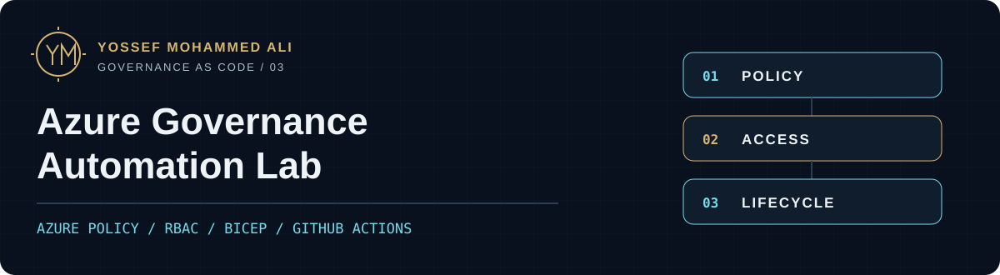

# Azure Governance Automation Lab

> Lab: CI validated; Azure deployment pending

An audit-first governance baseline that turns resource organization, tags, location policy, cost alerts, access and deletion protection into reviewable code. I authored subscription-scoped Bicep and guarded Bash/PowerShell operations for a personal, zero-workload lab.

[Case study](https://yossefseit.github.io/projects/azure-governance-automation/) · [Code](infra/main.bicep) · [Pipeline evidence](https://github.com/yossefseit/azure-governance-automation/actions/runs/31267342614) · [Deployment runbook](docs/deployment.md)

[](https://github.com/yossefseit/azure-governance-automation/actions/workflows/ci.yml)

| Focus | Implementation |
| --- | --- |
| Observe before enforcement | Custom policy initiative with tags and locations in `Audit`; inheritance disabled |
| Bound access and cost signals | Optional resource-group Reader, budget notifications and a deletion lock |
| Account for the full lifecycle | Explicit context checks, reviewed `what-if`, confirmation gates and manifest-based cleanup |

## Architecture


The template creates one tagged governance resource group and an Azure Monitor action group, a subscription budget, three custom policy definitions grouped into one initiative, and one subscription policy assignment. The governance resource group has a `CanNotDelete` lock by default.

An optional Entra group receives Reader only at the governance resource-group scope. Enabling inheritance with `Modify` creates a system-assigned policy identity and subscription-scope Tag Contributor assignment; bounded remediation tasks require another explicit option. Neither is enabled by default. The committed example has no notification receiver.

[Detailed design](docs/design.md) · [Detailed architecture SVG](architecture/architecture.svg) · [Editable Mermaid source](architecture/architecture.mmd)

## Decisions and boundaries

| Decision | Default and trade-off |
| --- | --- |
| Required RG tags and allowed locations | `Audit` surfaces gaps before a reviewed move to `Deny`. |
| Tag inheritance | `Disabled` avoids subscription-wide tag writes and remediation permissions. Opt-in `Modify` adds missing tags while preserving explicit values. |
| Existing-resource remediation | Disabled; assertions require `Modify` before remediation can be requested. |
| Monthly budget | A stable, required start date and actual/forecast notifications. A budget warns; it does **not** stop or approve spending. |
| Human access | Disabled; an explicit Entra group can receive Reader only on the governance resource group. |
| Resource lock | `CanNotDelete` protects against deletion while allowing updates; cleanup removes it first. |
| Notification receivers | Empty in source; supply approved receivers through an ignored local parameter file. |

There is no VM, database, gateway, cluster, storage account or always-running workload. This personal lab is not a full enterprise landing zone and does not describe an employer system. It does not implement management-group hierarchy, platform/application subscriptions, identity lifecycle, networking, Defender plans, central log retention, exemptions or break-glass operations. [Scope and design](docs/design.md) · [Cost assumptions](docs/cost.md)

## Quick start: offline validation

Use Git, Bash, Python 3, `jq` for the mock cleanup tests, and either the standalone **Bicep CLI 0.46.1** or Azure CLI with that Bicep version installed. ShellCheck and PowerShell 7 enable the additional local checks; CI requires them and PSScriptAnalyzer.

```bash
git clone https://github.com/yossefseit/azure-governance-automation.git
cd azure-governance-automation
az bicep install --version v0.46.1
bash tests/run.sh
```

Installing Bicep can download that tool, but these validation commands do not authenticate to Azure or call Resource Manager. If you use a standalone Bicep binary instead, run `BICEP_BIN=/path/to/bicep bash tests/run.sh`. The runner lints and compiles the template and example parameters, checks repository and compiled-template invariants, parses Bash, and uses a mock Azure CLI to exercise subscription, confirmation, inventory, ownership, partial-state and cleanup-order guards. It runs ShellCheck and PowerShell checks when available. Generated output goes to temporary directories.

## Validation evidence

| Evidence | Result |
| --- | --- |
| Public `main` CI, **8 Aug 2026**, commit `9d29c0c` | [Passed on public main](https://github.com/yossefseit/azure-governance-automation/actions/runs/31267342614) |
| Bicep, offline guards, PowerShell analysis, Markdown/spelling/links and secret scan | Executed by the linked workflow |
| Authenticated ARM validation, `what-if` and Azure deployment | Pending |
| Policy evaluation, notification delivery, RBAC access and remediation | Pending |
| Cost observation and live teardown | Pending live teardown; cost observation pending |

No authenticated ARM validation, what-if, deployment, policy evaluation, notification delivery, remediation, cost observation or teardown has been performed.

The workflow has `contents: read`, no `id-token: write`, and no Azure login. A green run establishes repository validation for its exact public commit; it does not prove Azure validation or validate unpublished local changes. [Testing](docs/testing.md) · [Validation plan](docs/validation.md) · [Evidence checklist](evidence/README.md)

Cross-parameter safety uses experimental assertions in Bicep 0.46.1. The compiled template emits `languageVersion: 2.1-experimental` and an expected warning. Authenticated ARM acceptance remains unverified; this is a documented production-hardening gap.

## Deployment lifecycle

Azure operations require a personally owned lab subscription, an already-authenticated matching CLI context, permissions from the [access model](docs/access-model.md), and explicit cost approval. The Bash cleanup path requires `jq`; PowerShell 7 provides the parallel operational path. The scripts inspect the current context and never switch subscriptions.

First create an ignored local parameter file:

```bash
cp infra/environments/lab.example.bicepparam \
  infra/environments/lab.local.bicepparam
```

Review region, effects, budget amount and billing currency, and a first-of-month budget date accepted by the target subscription. The example date is compile-only. Preserve the chosen budget start date across reruns. Keep inheritance, remediation and reviewer access disabled for the initial deployment; real identifiers and receivers belong only in this ignored file.

The [deployment runbook](docs/deployment.md) includes separate authenticated validation and `what-if` commands. The deployment wrapper repeats those gates before prompting:

```bash
./scripts/deploy.sh \
  --subscription-id "${AZURE_LAB_SUBSCRIPTION_ID}" \
  --location westeurope \
  --deployment-name aglab-governance \
  --parameters infra/environments/lab.local.bicepparam
```

It requires `DEPLOY:aglab-governance` after successful validation and `what-if`. An incorrect phrase, EOF or failed gate stops before creation. PowerShell equivalents are in the same runbook. No deployment is claimed here.

### State transitions need care

Incremental deployment can retain previously created conditional resources after a flag is disabled. Cleanup manifest schema 1.2 keeps deterministic optional IDs and nested deployment names present so these resources remain discoverable. If reviewer access was ever enabled, preserve the same private group object ID through disable, redeployment and cleanup because it participates in the role-assignment name.

Do not use `Modify` → `Disabled` → `Modify` as an idempotency test. The retained deterministic role assignment can conflict with the newly issued policy identity and return `RoleAssignmentUpdateNotPermitted`. Perform full guarded cleanup before changing away from `Modify`, then deploy the desired state afresh. Disabling policy or deleting remediation does not undo previously written tags. [Rollback and identity lifecycle](docs/deployment.md#rollback-before-cleanup)

## Teardown

```bash
./scripts/cleanup.sh \
  --subscription-id "${AZURE_LAB_SUBSCRIPTION_ID}" \
  --deployment-name aglab-governance \
  --confirmation DELETE:aglab-governance
```

Cleanup reads the named deployment's exact manifest, verifies schema, IDs, scope, ownership markers and inventories, then removes the lock before policy, role, budget and group resources. It repeats inventory checks before group deletion, waits for confirmed absence, and deletes deployment records last. Unexpected resources, locks, descendant access, deployment history or query failures stop cleanup. Verified not-found states support resuming a partial cleanup. [Complete cleanup order and recovery](docs/cleanup.md)

Retain sanitized evidence before deleting the deployment record. Live teardown has not been tested.

## What I learned

- Incremental deployment and conditional creation need explicit cleanup design; a disabled flag does not guarantee an earlier resource is gone.
- Policy `Modify` couples an effect, managed identity, role assignment and remediation into one lifecycle decision.
- Cost governance must state what a control actually does. Budget alerts provide signals, while spending decisions still require a separate process.

## Documentation map

| Need | Start here |
| --- | --- |
| Understand the controls | [Design](docs/design.md), [naming and tagging](docs/naming-and-tagging.md), [access and optional OIDC](docs/access-model.md), [threat model](docs/threat-model.md) |
| Review the lifecycle | [Deployment](docs/deployment.md), [cleanup](docs/cleanup.md), [troubleshooting](docs/troubleshooting.md), [cost](docs/cost.md) |
| Inspect evidence | [Testing](docs/testing.md), [validation](docs/validation.md), [evidence template](evidence/evidence-template.md), [remaining roadmap](docs/roadmap.md) |
| Read implementation | [Bicep modules](infra/modules/), [example parameters](infra/environments/lab.example.bicepparam), [scripts](scripts/), [tests](tests/) |

## License and author

Released under the [MIT License](LICENSE). Official design references remain alongside the decisions in `docs/`.

**Yossef Mohammed Ali** · [Portfolio](https://yossefseit.github.io/) · [Download CV](https://yossefseit.github.io/Yossef_Mohammed_Ali_CV.pdf)
