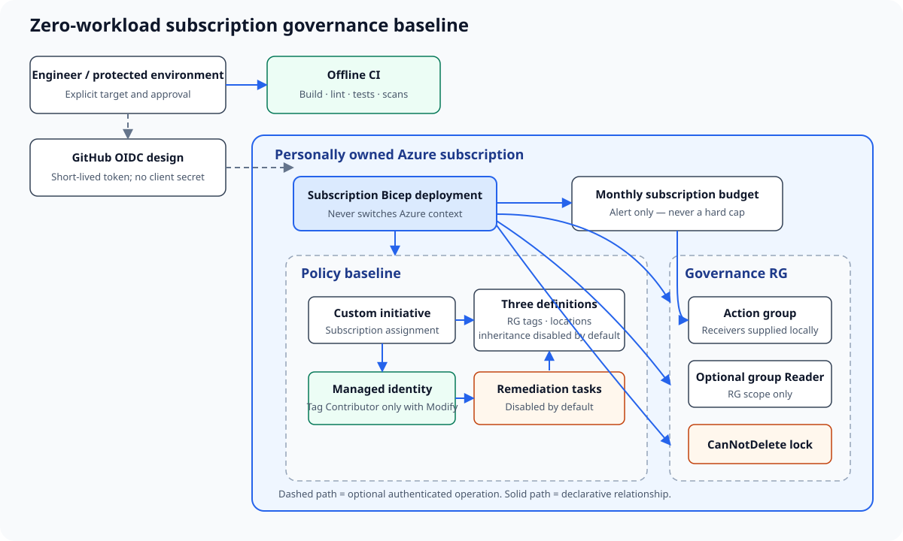

# Azure Governance Automation Lab

[](https://github.com/yossefseit/azure-governance-automation/actions/workflows/ci.yml)

A subscription-scoped Azure governance baseline built with modular Bicep and
guarded Bash/PowerShell operations. It turns six governance concerns into
reviewable code: resource organization, tags, location policy, cost alerts,
least-privilege access, and deletion protection.

> **Evidence boundary:** the templates are authored, locally linted, and
> compiled with Bicep CLI 0.46.1. Offline guard tests pass. No authenticated ARM
> validation, what-if, deployment, policy evaluation, notification delivery,
> remediation run, cost observation, or teardown has been performed. This lab
> is not a full enterprise landing zone.

## What this baseline produces

- One tagged governance resource group containing an Azure Monitor action group.
- A subscription budget that routes actual and forecast threshold notifications
  to that action group. A budget warns; it does **not** stop or approve spending.
- Three authored custom policy definitions grouped into one initiative:
  required resource-group tags, allowed resource locations, and inheritance of
  missing resource tags from the parent resource group.
- One subscription policy assignment with tag inheritance disabled by default.
  Selecting `Modify` adds a system-assigned identity and built-in Tag Contributor
  role; the default creates neither remediation permission nor tag writes.
- Optional, bounded remediation tasks for the two inherited tags; disabled by
  default because remediation changes existing resources.
- An optional Reader assignment for a Microsoft Entra group at only the
  governance resource-group scope.
- A `CanNotDelete` lock on the governance resource group, enabled by default and
  explicitly removed first by guarded cleanup.

No VM, database, gateway, cluster, storage account, or always-running workload is
created. Control-plane features in this baseline have no workload runtime, but
Azure pricing, account type, alert volume, and notification channels still need
verification for the target subscription. See [cost and guardrails](docs/cost.md).

## Architecture



The editable source is [architecture/architecture.mmd](architecture/architecture.mmd).

## Evidence matrix

| Capability | Authored | Locally validated | CI validated | Azure validated | Runtime tested | Teardown tested |
| --- | ---: | ---: | ---: | ---: | ---: | ---: |
| Subscription-scope Bicep | Yes | Linted and compiled | Pending first workflow run | Pending | Not applicable | Pending |
| Custom policies and initiative | Yes | Static tests and compile | Pending first workflow run | Pending | Pending policy evaluation | Pending |
| Conditional identity and remediation design | Yes | Static tests and compile | Pending first workflow run | Pending | Pending; inheritance and remediation disabled by default | Pending |
| Budget and action-group wiring | Yes | Static tests and compile | Pending first workflow run | Pending | Pending notification test | Pending |
| Optional group Reader RBAC | Yes | Static tests and compile | Pending first workflow run | Pending | Pending access test | Pending |
| Lock and cleanup automation | Yes | Failure guards tested offline | Pending first workflow run | Pending | Pending | Pending live teardown |

`Locally validated` means the checks named in [testing](docs/testing.md); it does
not mean the Azure Resource Manager service accepted or executed the template.
Cross-parameter safety uses Bicep assertions, which are experimental in Bicep
0.46.1 and emit ARM template `languageVersion: 2.1-experimental` plus an
expected feature warning; this remains a documented production-hardening gap.

## Safe defaults

| Decision | Default | Reason |
| --- | --- | --- |
| Location policy | `Audit` | Observe before introducing a deny control. |
| Required resource-group tags | `Audit` | Surface gaps without blocking an unfamiliar subscription. |
| Tag inheritance | `Disabled` | Avoid an implicit subscription-wide write and role assignment. |
| Opt-in inheritance | `Modify` for missing tags only | Preserve explicit values and grant the assignment identity Tag Contributor only after approval. |
| Existing-resource remediation | Disabled and asserted behind `Modify` | Avoid changing existing resources without a separate decision. |
| Budget start date | Required stable parameter | Prevent the billing period from drifting across reruns. |
| Optional human access | Disabled | Requires an explicit Entra group object ID and grants Reader only at the lab resource group. |
| Resource lock | `CanNotDelete` | Demonstrate deletion protection while allowing updates. |
| Notification receivers | Empty | No personal address belongs in source control; supply a local parameter at deployment time. |

Cleanup manifest schema 1.2 emits deterministic candidates for optional locks,
remediations, role assignments, and nested deployment-record names even when
creation flags are disabled. Guarded cleanup rejects unexpected direct resources,
locks, role assignments at or below the governance resource group, and module
deployment records before mutation; it repeats the inventories before group
deletion. If reviewer access is ever enabled, its private group object ID must
remain stable in the ignored parameter file through disable, redeployment, and
cleanup because that value participates in the assignment name.

Same-parameter reruns are designed to be idempotent, but the policy identity is
not safe to toggle arbitrarily. A `Modify` → `Disabled` → `Modify` sequence can
leave the earlier deterministic role assignment while Azure issues a new managed
identity principal, causing `RoleAssignmentUpdateNotPermitted`. Perform the full
guarded cleanup before that transition; see [deployment lifecycle](docs/deployment.md#rollback-before-cleanup).

## Repository map

```text
.
├── architecture/            # Mermaid source and optimized SVG
├── docs/                    # Design, access, threat, cost, runbooks, and sources
├── evidence/                # Sanitized evidence checklist; no fabricated output
├── infra/
│   ├── environments/        # Identifier-free example parameters
│   ├── modules/             # Scope-specific policy, cost, access, and lock modules
│   └── main.bicep            # Subscription orchestration
├── scripts/                 # Fail-closed Bash and PowerShell lifecycle commands
└── tests/                   # Dependency-light static and failure-guard tests
```

## Two-minute validation

Use a local Bicep CLI; this does not contact Azure:

```bash
BICEP_BIN=/path/to/bicep bash tests/run.sh
```

The test runner lints and compiles the main template and example parameter file,
checks repository invariants, parses every Bash script, and exercises subscription
mismatch, confirmation, ownership-marker, malformed/failed/drifted inventories,
partial states, and non-not-found errors with a mock Azure CLI. It also verifies
the complete lock-first cleanup and deployment-history deletion order.

Authenticated validation is deliberately separate:

```bash
./scripts/validate.sh \
  --subscription-id "${AZURE_LAB_SUBSCRIPTION_ID}" \
  --location westeurope \
  --parameters infra/environments/lab.local.bicepparam
```

The script never changes subscriptions. It stops unless the supplied ID exactly
matches the current Azure CLI context. Review [deployment](docs/deployment.md),
[validation](docs/validation.md), and [cleanup](docs/cleanup.md) before any Azure
operation.

## Design boundaries

This is a portfolio lab for one personally owned subscription. It deliberately
does not implement management-group hierarchy, platform/application landing-zone
subscriptions, identity lifecycle, network topology, Defender plans, central log
retention, policy exemptions, or enterprise break-glass operations. Those require
organizational context, licensing, and a verified tenant. The [design notes](docs/design.md)
explain how the baseline could move to management-group scope without claiming
that it already has.

## Lessons learned

- Incremental deployments retain earlier conditional resources when an option is
  disabled; deterministic manifest candidates plus inventory-guarded cleanup are
  needed to reconcile that residue safely.
- A budget is an alert, not a spending cap, and its start date is a stable
  lifecycle value rather than a clock-derived default.
- Azure Policy `Modify` couples policy effect, managed identity, RBAC, and
  remediation. Treat that combination as one reviewed lifecycle, not independent
  feature toggles.

## Documentation

- [Design and decisions](docs/design.md)
- [Naming and tagging](docs/naming-and-tagging.md)
- [Access and GitHub OIDC](docs/access-model.md)
- [Threat model](docs/threat-model.md)
- [Cost and guardrails](docs/cost.md)
- [Deployment runbook](docs/deployment.md)
- [Validation plan](docs/validation.md)
- [Testing](docs/testing.md)
- [Cleanup and rollback](docs/cleanup.md)
- [Troubleshooting](docs/troubleshooting.md)
- [Remaining live-evidence roadmap](docs/roadmap.md)

## License

Released under the [MIT License](LICENSE).
